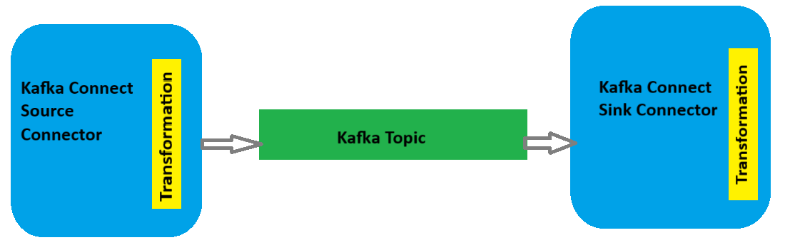
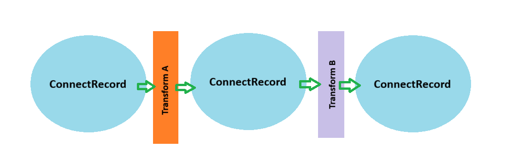

# Kafka JMS Connectors for Oracle Transactional Event Queues

Repository for the Kafka Sink Connector and Kafka Source Connector for Oracle Transactional Event Queues application.
The repository contains an application for a Sink Connector that reads from Kafka and stores into Oracle's TxEventQ.
The repository also contains an application for a Source Connector that reads from an Oracle TxEventQ and stores into a Kafka topic.

## Table of contents
* [Prerequisites](#prerequisites)
* [Build Connector Project](#build-connector-project)
* [Create Directory-Based Plugin](#create-directory-based-plugin)
* [Oracle Database Setup](#oracle-database-setup)
    * [Oracle Database Data Restrictions](#oracle-database-data-restrictions)
    * [Create Transactional Event Queue](#create-transactional-event-queue)
        * [KEY_BASED_ENQUEUE and SHARD_NUM parameter with TxEventQ Sink Connector](#key_based_enqueue-and-shard_num-parameter-with-txeventq-sink-connector)
        * [STICKY_DEQUEUE with TxEventQ Source Connector](#sticky_dequeue-with-txeventq-source-connector)
        * [Script to Create Transactional Event Queue](#script-to-create-transactional-event-queue)
    * [Create OKafka Topic](#create-okafka-topic)
    * [Oracle Database Automatic Memory Management](#oracle-database-automatic-memory-management)
    * [Connecting to an Oracle RAC Database](#connecting-to-an-oracle-rac-database)
    * [Steps to Create an Oracle Wallet](#steps-to-create-an-oracle-wallet)
* [Start Kafka Environment](#start-kafka-environment)
    * [Using downloaded files](#using-downloaded-files)
    * [Using JVM Based Apache Kafka Docker Image](using-jvm-based-apache-kafka-docker-image)
* [TxEventQ Sink Connector](#txeventq-sink-connector)
    * [TxEventQ Sink Connector Configuration Properties](#txeventq-sink-connector-configuration-properties)
    * [Running TxEventQ Sink Connector in Standalone Mode](#running-txeventq-sink-connector-in-standalone-mode)
    * [Running TxEventQ Sink Connector in Distributed Mode](#running-txeventq-sink-connector-in-distributed-mode)
* [TxEventQ Source Connector](#txeventq-source-connector)
    * [TxEventQ Source Connector Configuration Properties](#txeventq-source-connector-configuration-properties)
    * [Running TxEventQ Source Connector in Standalone Mode](#running-txeventq-source-connector-in-standalone-mode)
    * [Running TxEventQ Source Connector in Distributed Mode](#running-txeventq-source-connector-in-distributed-mode)
    * [Supported Message Types in Transactional Event Queue](#supported-message-types-in-transactional-event-queue)
    * [Headers](#headers)
    * [Schemas](#schemas)
        * [Key Schema](#key-schema)
        * [JMS Message Schema](#jms-message-schema)
        * [JMS Destination Schema](#jms-destination-schema)
        * [Property Value Schema](#property-value-schema)
* [Single Message Transforms](#single-message-transforms)
	* [Configuring Kafka Connect Single Message Transforms](#configuring-kafka-connect-single-message-transforms)
	* [Performing Multiple Transformations](#performing-multiple-transformations)
* [Kafka Connect Demo](#kafka-connect-demo)
    * [Requirements](#requirements)
    * [Quick Start](#quick-start)
    * [Available Commands](#available-commands)
    * [Container Descriptions](#container-descriptions)
    * [Access Points](#access-points)

## Prerequisites
* Java 17+ installed.
* [Apache Kafka](https://kafka.apache.org/) with minimum version of 3.1.0 installed on a server.
* Oracle Database with minimum version of 23 in order for all functionality to be performed.

## Build Connector Project
Clone the project from the repository. Open a bash window and change the directory to the location where the cloned project has been saved.
Run the following command from the bash window to compile the source.

```bash
mvn clean package
```
## Create Directory-Based Plugin
We will be packaging the TxEventQ connector as a directory containing the connector built from running the command
above on the TxEventQ connector repository add all of the its dependencies listed below as separate .jar files.

1. Create a directory with a descriptive name (e.g., my-custom-connector-1.0.0).
2. Place `txeventq-connector-<version>.jar` file and all of the dependent jar files listed below into the directory created above.
    * `ojdbc11-<version>.jar`
    * `oraclepki-<version>.jar`
    * `osdt_core-<version>.jar`
    * `osdt_cert-<version>.jar`
    * `aqapi-<version>.jar`
    * `javax.jms-api-<version>.jar`
    * `jta-<version>.jar`
3. In the Kafka Connect worker's configuration file (e.g., connect-distributed.properties or connect-standalone.properties), configure the plugin.path property to the parent directory containing the TxEventQ connector's folder: 
    * `plugin.path=/usr/local/share/kafka/plugins/`

Below is an example file structure for a directory-based plugin. 

```text
/usr/local/share/kafka/plugins/
└── txeventq-connector-23.26.0.25.12/
    ├── txeventq-connector-23.26.0.25.12.jar
    ├── aqapi-23.8.0.0.jar
    └── javax.jms-api-2.0.1.jar
    ├── jta-1.1.jar
    ├── ojdbc11-23.26.0.0.0.jar
    └── oraclepki-23.26.0.0.0.jar
    ├── osdt_cert-21.20.0.0.jar
    ├── osdt_core-21.20.0.0.jar
```
**Note:** The TxEventQ Connector jar file can be downloaded from this [Maven repository](https://mvnrepository.com/artifact/com.oracle.database.messaging/txeventq-connector) if you don't want
to build the jar. You will still need to get the additional jar files mentioned above and place in the a directory with the TxEventQ Connector jar. The jar files listed above can also be download
from Maven.

## Oracle Database Setup
To run the Kafka TxEventQ Sink and Source Connector against an Oracle Database, a database user needs to be created and needs to be granted the privileges below.

```roomsql
create user <username> identified by <password>
grant connect, resource to <username>
grant execute on dbms_aqadm to <username>
grant execute on dbms_aqin to <username>
grant execute on dbms_aqjms to <username>
grant select_catalog_role to <username>
grant select on sys.V_$PARAMETER to <username>;
```
Once a user is created and above privileges are granted, connect to Oracle Database as this user and create a Transactional Event Queue or Oracle Kafka Topic using the appropriate PL/SQL script below. 

### Create Transactional Event Queue
The information provided below will indicate what parameter options should be set when creating a transactional event queue that will be used by the TxEventQ Sink or Source Connector. If planning to use the TxEventQ Sink and Source connector on the same transactional event queue all relevant parameters such as KEY_BASED_ENQUEUE, SHARD_NUM, and STICKY_DEQUEUE should be set before using the connector. The KEY_BASED_ENQUEUE and STICKY_DEQUEUE parameters cannot be changed once it has been set.
**Note: The Sink Connector supports a JMS type Transactional Event Queue payload, which is the default paayload. The TxEventQ Sink Connector will store the payload as a JMS_BYTES message.**

##### KEY_BASED_ENQUEUE and SHARD_NUM parameter with TxEventQ Sink Connector
The KEY_BASED_ENQUEUE parameter is used to determine which shard a message is enqueued to. There are 3 valid values that can be set for this parameter.
The table below will describe the different KEY_BASED_ENQUEUE values and what is required for SHARD_NUM when using the TxEventQ sink connector.

|KEY_BASED_ENQUEUE| SHARD_NUM|Description|
|-----------------|----------|-----------|
|0 (default)      | >= 1     |A key is not used during the enqueue. A session is bound to a shard at the time of first enqueue to the queue. All messages enqueued by the session will go to the same shard to which the session is bound.
|1                | >= 1     |The database correlation value will be used as the key. The correlation value will be used to determine which shard the messages will be enqueued to. The key is limited 128 bytes. The TxEventQ sink connector will truncate the key if it is greater than the maximum length.
|2                | >= the number of Kafka partitons|In this case messages from a Kafka topic partition will be mapped to its respective shard by specifying the shard number in the AQINTERNAL_PARTITION property. In this case the SHARD_NUM value for the queue will need to be greater than or equal to the number of Kafka partitions for the topic that the TxEventQ sink connector will be consuming from.  


##### STICKY_DEQUEUE with TxEventQ Source Connector
When using the Source Connector and ordering of the events is required, then the Transactional Event Queue that the TxEventQ Source connector will be pulling from needs to be created with the `STICKY_DEQUEUE` parameter set to 1 and the source connector configuration file needs to have the property `txeventq.map.shard.to.kafka_partition` set to true.

Here is the source connector configuration property that needs to be set in the configuration properties file that is discussed in more details below.

```roomsql
txeventq.map.shard.to.kafka_partition=true
```
##### Script to Create Transactional Event Queue
The PL/SQL script below can be copied and used to create a transactional event queue that will be used by the TxEventQ Sink and Source Connector. Update all parameter setting values appropriately. Refer to parameter informations above for more details and requirements..

**Note: Remove the set_queue_parameter calls for either the `STICKY_DEQUEUE` or `KEY_BASED_ENQUEUE` properties if you want to create the queue with the default value of 0 for either of these.** 
```roomsql
exec sys.dbms_aqadm.create_transactional_event_queue(queue_name=>"TxEventQ", multiple_consumers => TRUE); 
exec sys.dbms_aqadm.set_queue_parameter('TxEventQ', 'SHARD_NUM', 1);
exec sys.dbms_aqadm.set_queue_parameter('TxEventQ', 'STICKY_DEQUEUE', 1);
exec sys.dbms_aqadm.set_queue_parameter('TxEventQ', 'KEY_BASED_ENQUEUE', 1);
exec sys.dbms_aqadm.start_queue('TxEventQ');

-- Also need to add subscriber if creating a multiple_consumers queue
exec sys.dbms_aqadm.add_subscriber('TxEventQ', SYS.AQ$_AGENT('SUB1', NULL, 0));
```
**Note: If running on an Oracle database version less than 23.4 with `STICKY_DEQUEUE` set to 1 the source connector configuration file property `tasks.max` value must be equal to the `SHARD_NUM` specified. If the `tasks.max` is not equal to the `SHARD_NUM` dequeue from all event streams will not be performed.**

### Create OKafka Topic
If using the TxEventQ Sink or Source Connector on an Okafka topic it is important to understand what parameters the Okafka topic will have and what needs to be set.
|KEY_BASED_ENQUEUE| partition_num                   |Description|
|-----------------|---------------------------------|-----------|
|2 (always)       | >= the number of Kafka partitons|In this case messages from a Kafka topic partition will be mapped to its respective shard by specifying the shard number in the AQINTERNAL_PARTITION property. In this case the partition_num parameter value for the Okafka topic will need to be greater than or equal to the number of Kafka partitions for the topic that the TxEventQ sink connector will be consuming from.  

 
If attempting to use the TxEventQ Source Connector on an Okafka topic the `partition_assignment_mode` will need to be set to 0 or 1 as shown below. Setting `partition_assignment_mode` to 1 means setting `STICKY_DEQUEUE` to 1.

|partition_assignment_mode| Description                     |
|-------------------------|---------------------------------|
|0                        | No sticky dequeue is set which means messages dequeued by a session can spread across multiple shards of the queue.
|1                        | Sticky dequeue is set and dequeue session sticks to a shard in the queue. A session is bound to a shard on first dequeue from the queue. All messages dequeued by the session come from the same shard to which it is bound.

```roomsql
exec sys.dbms_aqadm.create_database_kafka_topic( topicname=> 'TxEventQ', partition_num=>1, retentiontime => 7*24*3600, partition_assignment_mode => 1);

-- Also need to add subscribers because the Okafka topic is a multiple_consumers queue
exec sys.dbms_aqadm.add_subscriber('TxEventQ', SYS.AQ$_AGENT('SUB1', NULL, 0));
```

### Oracle Database Data Restrictions
In the Transactional Event Queues (TEQ) the correlation value is restricted to 128 bytes. As a result of this restriction the key used
for a Kafka record is also limited to 128 bytes. The TxEventQ sink connector will truncate the key value if it exceeds the maximum limit.

### Oracle Database Automatic Memory Management 
It is recommended that the database be configured to allow automatic memory management. Refer to [About Automatic Memory Management](https://docs.oracle.com/en/database/oracle/oracle-database/23/admin/managing-memory.html#GUID-0F348EAB-9970-4207-8EF3-0F58B64E959A)
for information on how to allow the Oracle Database instance to automatically manage instance memory.

### Connecting to an Oracle RAC Database
If connecting to an Oracle RAC database the tnsnames.ora file will need to specify an **ADDRESS_LIST** with the **ADDRESS** for each of the nodes if the nodes are on different host machines. If the nodes are all on the same host machine a single **ADDRESS**
entry in the tnsnames.ora file is sufficient.

Here is an example of what the entry in the tnsnames.ora file would be if the nodes are on different machines:

```text
RAC_DB = (DESCRIPTION = 
	(CONNECT_TIMEOUT= 90)(RETRY_COUNT=50)(RETRY_DELAY=3)(TRANSPORT_CONNECT_TIMEOUT=3)
    (ADDRESS_LIST = 

        (ADDRESS = (PROTOCOL=tcp)(HOST=racnode1.example.com)(PORT=1521)) 

        (ADDRESS = (PROTOCOL=tcp)(HOST=racnode2.example.com)(PORT=1521)) 

        (ADDRESS = (PROTOCOL=tcp)(HOST=racnode3.example.com)(PORT=1521)) 

    ) 
    (CONNECT_DATA = (SERVICE_NAME=mydatabase)) 
)
```

If connecting to an Oracle RAC database using [SCANs](https://docs.oracle.com/en/database/oracle/oracle-database/23/rilin/about-connecting-to-an-oracle-rac-database-using-scans.html) the tnsnames.ora file should reference
the SCAN as the example below will show:

```text
RAC_DB_WITH_SCAN = (DESCRIPTION = 
	(CONNECT_TIMEOUT= 90)(RETRY_COUNT=50)(RETRY_DELAY=3)(TRANSPORT_CONNECT_TIMEOUT=3)
    (ADDRESS = (PROTOCOL = tcp)(HOST = rac-scan.example.com)(PORT = 1521)) 

    (CONNECT_DATA = (SERVICE_NAME = myrac_service)) 
)
```

### Steps to Create an Oracle Wallet

Create or modify a tnsnames.ora file. The entry in the file should have the following form.

```text
alias=(DESCRIPTION=(ADDRESS=(PROTOCOL=TCP)(HOST=host)(PORT=port))(CONNECT_DATA=(SERVICE_NAME=service)))
```

An Oracle Wallet will also need to be created in order for the Connector to connect to the database.
Refer to the following site for additional details on how to create an Oracle Wallet [JDBC Thin Connections with a Wallet](https://docs.oracle.com/en/cloud/paas/autonomous-database/adbsa/connect-jdbc-thin-wallet.html#GUID-BE543CFD-6FB4-4C5B-A2EA-9638EC30900D)
and [orapki Utility](https://docs.oracle.com/cd/B19306_01/network.102/b14268/asoappf.htm#CDEFHBGA).

Oracle recommends creating and managing the Wallet in a database environment since this environment provides all the necessary commands and libraries,
including the $ORACLE_HOME/oracle_common/bin/mkstore command.

Enter the following command to create a wallet:

```bash
mkstore -wrl <wallet_location> -create
```

The mkstore command above will prompt for a password that will be used for subsequent commands. Passwords must have a minimum length of eight characters and contain alphabetic characters combined with numbers or special characters.
If the create is successful when you go to the wallet location specified above a couple of cwallet and ewallet files should have been created in that directory.

Enter the following command to add the credential for the data source name added previously to tnsnames.ora to the Oracle Wallet:

```bash
mkstore -wrl <wallet_location> -createCredential <alias name from tnsnames.ora> <username> <password>
```

If a password is requested enter in the password from the step above.

The wallet directory that will need to be specified in the connection properties file below should contain the following files.

- cwallet.sso
- ewallet.p12

## Start Kafka Environment
Kafka can be run using local scripts and downloaded files or the docker image.

#### Using downloaded files
Generate a Cluster UUID:

```bash
KAFKA_CLUSTER_ID="$(bin/kafka-storage.sh random-uuid)" 
```

Format Log Directories:

```bash
bin/kafka-storage.sh format --standalone -t KAFKA_CLUSTER_ID -c config/server.properties
```
Start the Kafka Server:

```bash
bin/kafka-server-start.sh config/server.properties 
```

#### Using JVM Based Apache Kafka Docker Image

Get the Docker image:

```bash
docker pull apache/kafka:4.1.0
```

Start the Kafka Docker container: 

```bash
docker run -p 9092:9092 apache/kafka:4.1.0
```

# TxEventQ Sink Connector
The TxEventQ Sink Connector by default will not process header information from the Kafka message into the Transactional EventQ as part of the payload. However, if any of the two sink connector properties `txeventq.jms.bytes.include.kafka.headers` and `txeventq.jms.bytes.include.kafka.metadata` is set to true the header and metadata information will be stored as header information in the message payload.
The constructed Byte Payload that will be stored in the Oracle Transactional EventQ will have the following format:

```text
	  | KEY LENGTH (4 Bytes Fixed)          | KEY   |
	  | VALUE LENGTH (4 BYTES FIXED)        | VALUE |
	  | HEADER NAME LENGTH(4 BYTES FIXED)   | HEADER NAME |
	  | HEADER VALUE LENGTH (4 BYTES FIXED) | HEADER VALUE |
	  | HEADER NAME LENGTH(4 BYTES FIXED)   | HEADER NAME |
	  | HEADER VALUE LENGTH (4 BYTES FIXED) | HEADER VALUE |
```
Additional header name/value pairs are added depending on the number of header information specified and a header count will be calculated
and stored in property `AQINTERNAL_HEADERCOUNT` in the Transactional EventQ. 

### TxEventQ Sink Connector Configuration Properties

| Property Name                        | Type             | Default Value | Importance | Valid Values                                  				   | Description                                                  |
|--------------------------------------|------------------|---------------|------------|---------------------------------------------------------------|-----------------------------------------------|
|name                                  |string            |               |high        |non-empty string without ISO control characters                |Globally unique name to use for this connector.
|connector.class                       |string            |               |high        |oracle.jdbc.txeventq.kafka.connect.sink.TxEventQSinkConnector  |Name or alias of the class for this connector. Must be a subclass of org.apache.kafka.connect.connector.Connector.
|tasks.max                             |int               |1              |high        |[1,...]                                                        |Maximum number of tasks to use for this connector.
|topics                                |list              |""             |high        |                                                               |List of topics to consume, separated by commas.
|wallet.path                           |string            |               |high        |A valid directory path                                         |The location of Oracle Wallet (ewallet.sso, ewallet.p12). Oracle Wallet provides a simple and easy method to manage database credentials across multiple domains. We will be using the Oracle TNS (Transport Network Substrate) administrative file to hide the details of the database connection string (host name, port number, and service name) from the datasource definition and instead us an alias.
|tnsnames.path                         |string            |               |high        |A valid directory path                                         |The directory location of the tnsnames.ora. The entry in the tnsnames.ora should have the following format: <aliasname> = (DESCRIPTION =(ADDRESS_LIST =(ADDRESS = (PROTOCOL = TCP)(Host = <hostname>)(Port = <port>)))(CONNECT_DATA =(SERVICE_NAME = <service_name>)))
|db_tns_alias                          |string            |               |high        |                                                               |The TNS alias name for the database to connect to stored in the tnsnames.ora.
|txeventq.queue.name				   |string            |               |high        |                                                               |The TxEventQ to put the Kafka data into.
|txeventq.queue.schema                 |string            |               |high        |                                                               |The name of the schema for the TxEventQ specified in the txeventq.queue.name property field.  
|bootstrap.servers                     |list              |               |high        |                                                               |A list of host/port pairs used to establish the initial connection to the Kafka cluster. This list must be in the form host1:port1,host2:port2,....
|txeventq.jms.bytes.include.kafka.headers|boolean         |false          |low         |                                                               |Indicates whether the JMS Bytes message will process Header information from Kafka header into TxEventQ. The default value for this property is False and Header information from Kafka will not be processed into TxEventQ.
|txeventq.jms.bytes.include.kafka.metadata|boolean        |false          |low         |                                                               |If enabled, metadata from the Kafka record is forwarded to TxEventQ as part of the Header information stored in the message payload. If this property is set to TRUE, the property txeventq.jms.bytes.include.kafka.headers needs to also be set to TRUE. This includes the record's topic, partition, offset, and timestamp. The topic name is applied as a String property named KAFKA_TOPIC, the partition value is applied as an Int property named KAFKA_PARTITION, the offset value is applied as a Long property named KAFKA_OFFSET, and the timestamp value is applied as a Long property named KAFKA_TIMESTAMP.
|key.converter                         |class             |               |low         |A concrete subclass of org.apache.kafka.connect.storage.Converter. The specific class you set for this property depends on how the key is serialized in the Kafka topic.  Common choices include: org.apache.kafka.connect.storage.StringConverter, org.apache.kafka.connect.json.JsonConverter, org.apache.kafka.connect.converters.ByteArrayConverter |Converter class used to convert between Kafka Connect format and the serialized form that is written to Kafka. This controls the format of the keys in messages written to or read from Kafka.  
|value.converter                       |class             |               |low         |A concrete subclass of org.apache.kafka.connect.storage.Converter. The specific class you set for this property depends on how the key is serialized in the Kafka topic.  Common choices include: org.apache.kafka.connect.storage.StringConverter, org.apache.kafka.connect.json.JsonConverter, org.apache.kafka.connect.converters.ByteArrayConverter |Converter class used to convert between Kafka Connect format and the serialized form that is written to Kafka. This controls the format of the values in messages written to or read from Kafka.  

### Running TxEventQ Sink Connector in Standalone Mode
This mode is typically used for development, testing, or lightweight, single-agent environments.

You need two configuration files, one for the configuration for the Kafka Connect worker process itself when it's operating as a single, isolated instance, and another for the configuration specific to the TxEventQ Sink Connector. For the former, the Kafka distribution includes a file called `connect-standalone.properties` that you can use as a starting point. For the latter, you can copy and save the [config/connect-txeventq-sink.properties](config/connect-txeventq-sink.properties) in this repository and make the required configuration updates.

Update Kafka's `connect-standalone.properties`configuration file located in Kafka's config directory `plugin.path=` property with the directory path to where the jar file for the connectors is located as was described in section [Create Directory-Based Plugin](#create-directory-based-plugin). The `consumer.max.poll.records` property can also be specified to a different value in the `connect-standalone.properties` to increase or decrease the number of records that will be sent by the sink connector for each poll. The default value for the `consumer.max.poll.records` is 500.
Make sure the Kafka server is up and running. Instructions for starting the Kafka server can be found at [Start Kafka Environment](#start-kafka-environment). 
In a terminal start the connector in standalone mode using the connect-standalone.sh file. The command being used is shown below.

```bash
bin/connect-standalone.sh config/connect-standalone.properties config/connect-txeventq-sink.properties 
```
### Running TxEventQ Sink Connector in Distributed Mode
Distributed mode runs Connect workers on multiple machines in a cluster, providing scalability and automatic fault tolerance by distributing tasks across workers, making it ideal for production environments. 

The Kafka distribution includes a file called `connect-distributed.properties` that you can use as a starting point. Update Kafka's `connect-distributed.properties`configuration file located in Kafka's config directory `plugin.path=` property with the directory path to where the jar file for the connectors is located as was described in section [Create Directory-Based Plugin](#create-directory-based-plugin). The `consumer.max.poll.records` property can also be specified to a different value in the `connect-distributed.properties` to increase or decrease the number of records that will be sent by the sink connector for each poll. The default value for the `consumer.max.poll.records` is 500.
Make sure the Kafka server is up and running. Instructions for starting the Kafka server can be found at [Start Kafka Environment](#start-kafka-environment). 
In a terminal start Kafka connect in distributed mode using the `connect-distributed.sh` file. The command being used is shown below.

```bash
bin/connect-distributed.sh config/connect-distributed.properties
```

To start the TxEventQ Sink Connector, you can use the [config/txeventQ-sink.json](config/txeventq-sink.json) in this repository after replacing all placeholders, adding additional properties, or modifying properties and use a command like this:

```bash
curl -X POST -H "Content-Type: application/json" --data "@./config/txeventQ-sink.json" http://localhost:8083/connectors 
```
# TxEventQ Source Connector
The TxEventQ Source Connector will move messages from a specified transactional event queue into a specified Kafka topic.

### TxEventQ Source Connector Configuration Properties

| Property Name                        | Type             | Default Value | Importance | Valid Values                                  				     | Description                                                  |
|--------------------------------------|------------------|---------------|------------|-----------------------------------------------------------------|-----------------------------------------------|
|name                                  |string            |               |high        |non-empty string without ISO control characters                  |Globally unique name to use for this connector.
|connector.class                       |string            |               |high        |oracle.jdbc.txeventq.kafka.connect.source.TxEventQSourceConnector|Name or alias of the class for this connector. Must be a subclass of org.apache.kafka.connect.connector.Connector.
|tasks.max                             |int               |1              |high        |[1,...]                                                          |Maximum number of tasks to use for this connector.
|txeventq.batch.size                   |int               |250            |low         |[1,...]                                                          |The maximum number of records to dequeue from the Oracle Transactional Event Queue before writing to Kafka.
|kafka.topic                           |string            |""             |high        |                                                                 |The name of the Kafka topic where the connector writes all records that were read from the TxEventQ.
|wallet.path                           |string            |               |high        |A valid directory path                                           |The location of Oracle Wallet (ewallet.sso, ewallet.p12). Oracle Wallet provides a simple and easy method to manage database credentials across multiple domains. We will be using the Oracle TNS (Transport Network Substrate) administrative file to hide the details of the database connection string (host name, port number, and service name) from the datasource definition and instead us an alias.
|tnsnames.path                         |string            |               |high        |A valid directory path                                           |The directory location of the tnsnames.ora. The entry in the tnsnames.ora should have the following format: <aliasname> = (DESCRIPTION =(ADDRESS_LIST =(ADDRESS = (PROTOCOL = TCP)(Host = <hostname>)(Port = <port>)))(CONNECT_DATA =(SERVICE_NAME = <service_name>)))
|db_tns_alias                          |string            |               |high        |                                                                 |The TNS alias name for the database to connect to stored in the tnsnames.ora.
|txeventq.queue.name				   |string            |               |high        |                                                                 |The TxEventQ to pull data from to put into the specified Kafka topic.
|txeventq.subscriber                   |string            |               |high        |                                                                 |The subscriber for the TxEventQ that data will be pulled from to put into the specified Kafka topic.
|bootstrap.servers                     |list              |               |high        |                                                                 |A list of host/port pairs used to establish the initial connection to the Kafka cluster. This list must be in the form host1:port1,host2:port2,....
|use.schema.for.jms.msgs               |boolean           |false          |low         |                                                                 |If set to True the built in schema for JMS Messages will be used and stored in the message payload. The JMS messages types that are supported are BytesMessage, TextMessage, and MapMessage.
|header.jms.allowlist                  |list              |""             |low         |                                                                 |Comma separated list of JMS Message header keys to include to the Kafka header. The valid JMS Message header keys that can be added to the list are: jmsMessageType, jmsMessageId, jmsCorrelationId, jmsDestination, jmsReplyTo, jmsPriority, jmsDeliveryMode, jmsRetry_count, jmsExpiration, jmsTimestamp, jmsType, jmsRedelivered, and jmsProperties. If the configuration property use.schema.for.jms.msgs is set to True then the list specified in header.jms.allowlist will be ignored because all the JMS Message properties will be stored in the Kafka message as a JSON schema.   
|header.denylist                       |list              |""             |low         |                                                                 |Comma separated list of header keys to exclude from the Kafka header. If the TxEventQ Sink connector was used to place messages into TxEventQ and the txeventq.jms.bytes.include.kafka.metadata property was set to True then the following MetaData (Kafka topic name, Kafka partition, Kafka offset, and Kafka timestamp) will be stored as header information with the following keys: KAFKA_TOPIC, KAFKA_PARTITION, KAFKA_OFFSET, KAFKA_TIMESTAMP. If any of these header information should be excluded add them to the list along with any other header keys to exclude.
|txeventq.map.shard.to.kafka_partition |boolean           |false          |low         |                                                                 |If set to True messages from a TxEventQ shard will be placed into the respective Kafka partition. If ordering within the shards need to be maintained when sent to the Kafka topic this property will need to be set to True and the TxEventQ will need to be created with 'STICKY_DEQUEUE' queue parameter set to 1. If this property is set to True the number of Kafka partitions for the topic will need to be equal or greater than the number of shards for the TxEventQ. If this property is set to False messages will be sent to a Kafka partition based on the message key or a round-robin approach if no key is provided.
|source.max.poll.blocked.time.ms       |int               |2000           |medium      |                                                                 |Indicates the amount of time in milliseconds the connector should wait for the prior batch of messages to be sent to Kafka before a new poll request is made. The time specified here should be less than the time defined for the [task.shutdown.graceful.timeout.ms](https://kafka.apache.org/documentation/#connectconfigs_task.shutdown.graceful.timeout.ms) property since this is the time used by Kafka to determine the amount of time to wait for the tasks to shutdown gracefully. 
|key.converter                         |class             |               |low         |A concrete subclass of org.apache.kafka.connect.storage.Converter. The specific class you set for this property depends on how the key is serialized in the Kafka topic.  Common choices include: org.apache.kafka.connect.storage.StringConverter, org.apache.kafka.connect.json.JsonConverter, org.apache.kafka.connect.converters.ByteArrayConverter |Converter class used to convert between Kafka Connect format and the serialized form that is written to Kafka. This controls the format of the keys in messages written to or read from Kafka. If the connector is processing JMS type messages and the `use.schema.for.jms.msgs` configuration property described above is set to true these messages will be set as structured data in JSON format. As a result of this the org.apache.kafka.connect.json.JsonConverter should be used.  
|key.converter.schemas.enable          |boolean           |false          |low         |                                                                                                                                                                                                                                                                                                                                                        |This configuration property determines whether the schema of the key is included with the data when it is serialized. If set to True the key not treated as plain JSON, but rather as a composite JSON object containing both an internal schema and the data. If set to False only the data is passed along, without the schema. This reduces the payload overhead for applications that do not need a schema.
|value.converter                       |class             |               |low         |A concrete subclass of org.apache.kafka.connect.storage.Converter. The specific class you set for this property depends on how the key is serialized in the Kafka topic.  Common choices include: org.apache.kafka.connect.storage.StringConverter, org.apache.kafka.connect.json.JsonConverter, org.apache.kafka.connect.converters.ByteArrayConverter |Converter class used to convert between Kafka Connect format and the serialized form that is written to Kafka. This controls the format of the values in messages written to or read from Kafka. If the connector is processing JMS type messages and the `use.schema.for.jms.msgs` configuration property described above is set to true these messages will be set as structured data in JSON format. As a result of this the org.apache.kafka.connect.json.JsonConverter should be used.  
|value.converter.schemas.enable        |boolean           |false          |low         |                                                                                                                                                                                                                                                                                                                                                        |This configuration property determines whether the schema of the value is included with the data when it is serialized. If set to True the value not treated as plain JSON, but rather as a composite JSON object containing both an internal schema and the data. If set to False only the data is passed along, without the schema. This reduces the payload overhead for applications that do not need a schema.              

### Running TxEventQ Source Connector in Standalone Mode
This mode is typically used for development, testing, or lightweight, single-agent environments.

You need two configuration files, one for the configuration for the Kafka Connect worker process itself when it's operating as a single, isolated instance, and another for the configuration specific to the TxEventQ Source Connector. For the former, the Kafka distribution includes a file called `connect-standalone.properties` that you can use as a starting point. For the latter, you can copy and save the [config/connect-txeventq-source.properties](config/connect-txeventq-source.properties) in this repository and make the required configuration updates.

Update Kafka's `connect-standalone.properties`configuration file located in Kafka's config directory `plugin.path=` property with the directory path to where the jar file for the connectors is located as was described in section [Create Directory-Based Plugin](#create-directory-based-plugin).
Make sure the Kafka server is up and running. Instructions for starting the Kafka server can be found at [Start Kafka Environment](#start-kafka-environment). 
In a terminal start the connector in standalone mode using the connect-standalone.sh file. The command being used is shown below.

```bash
bin/connect-standalone.sh config/connect-standalone.properties config/connect-txeventq-source.properties 
```
### Running TxEventQ Source Connector in Distributed Mode
Distributed mode runs Connect workers on multiple machines in a cluster, providing scalability and automatic fault tolerance by distributing tasks across workers, making it ideal for production environments. 

The Kafka distribution includes a file called `connect-distributed.properties` that you can use as a starting point. Update Kafka's `connect-distributed.properties`configuration file located in Kafka's config directory `plugin.path=` property with the directory path to where the jar file for the connectors is located as was described in section [Create Directory-Based Plugin](#create-directory-based-plugin).
Make sure the Kafka server is up and running. Instructions for starting the Kafka server can be found at [Start Kafka Environment](#start-kafka-environment). 
In a terminal start Kafka connect in distributed mode using the `connect-distributed.sh` file. The command being used is shown below.

```bash
bin/connect-distributed.sh config/connect-distributed.properties
```

To start the TxEventQ Source Connector, you can use the [config/txeventQ-source.json](config/txeventQ-source.json) in this repository after replacing all placeholders, adding additional properties, or modifying properties and use a command like this:

```bash
curl -X POST -H "Content-Type: application/json" --data "@./config/txeventQ-source.json" http://localhost:8083/connectors 
```

### Supported Message Types in Transactional Event Queue
The TxEventQ Source Connector is able to read the following types of data from a Transactional Event Queue:
* JMS message types the TxEventQ Source Connector supports are `BytesMessage`, `TextMessage`, and `MapMessage`. The TxEventQ Source Connector does not currently support `ObjectMessage` and `StreamMessage`.
* Raw message types
* JSON message types

### Headers
The Oracle TxEventQ Source Connector will be able to process header information for TxEventQ messages of type **JmsBytesMessage**,
that have a MessageVersion property value of 2. If a message of this type is encountered the header information that is stored
in the message payload will be extracted and placed into the required Kafka topic's header field. The number of headers that will
need to be processed is determined by looking at count value stored in the property `AQINTERNAL_HEADERCOUNT`.

### Schemas
The Oracle TxEventQ Source Connector will produce JMS messages with keys and values that
correspond to the schemas that will be described below if the message is a supported JMS message type
and the **use.schema.for.jms.msgs** configuration property is set to **true**. Click this [link](https://docs.oracle.com/en/database/oracle/oracle-database/23/adque/java_message_service.html#GUID-88D337F6-3C9F-41C6-9D55-559B48B350EF) for additional
information on JMS messages for an Oracle Transactional Event Queues.

##### Key Schema
This schema is used to store the incoming correlation id if one is present on the message interface. It will
be used as the key for the message that will be placed into a Kafka topic. The schema defines the following fields:

| Field Name    | Schema                      							| Required | Default Value | Description                                                  |
|---------------|-------------------------------------------------------|----------|---------------|--------------------------------------------------------------|
| correlation   | String                                                | Yes      |               |This field stores the value of [Message.getJMSCorrelationID()](https://docs.oracle.com/javaee/7/api/javax/jms/Message.html#getJMSCorrelationID()).|

##### JMS Message Schema
This schema is used to store the value of the JMS message. The schema defines the following fields:

| Field Name       | Schema                      							| Required | Default Value | Description                                                  |
|------------------|--------------------------------------------------------|----------|---------------|--------------------------------------------------------------|
| jmsMessageId     | String                      							| Yes      | 			   | This field stores the value of [Message.getJMSMessageID()](https://docs.oracle.com/javaee/7/api/javax/jms/Message.html#getJMSMessageID()).|
| jmsMessageType   | String                      							| Yes      | 			   | `text`, `map` or `bytes` depending on received message type. |
| jmsCorrelationId | String                      							| No       | 			   | This field stores the value of [Message.getJMSCorrelationID()](https://docs.oracle.com/javaee/7/api/javax/jms/Message.html#getJMSCorrelationID()).|
| jmsDestination   | [JMS Destination](#jms-destination-schema)			    | No       | 			   | This schema is used to represent a JMS Destination, and is either [queue](https://docs.oracle.com/javaee/7/api/javax/jms/Queue.html) or [topic](https://docs.oracle.com/javaee/7/api/javax/jms/Topic.html).|
| jmsReplyTo       | [JMS Destination](#jms-destination-schema)			    | No       | 			   | This schema is used to represent a JMS Destination, and is either [queue](https://docs.oracle.com/javaee/7/api/javax/jms/Queue.html) or [topic](https://docs.oracle.com/javaee/7/api/javax/jms/Topic.html).|
| jmsPriority      | Int32                       							| No       | 	    	   | This field stores the value of [Message.getJMSPriority()](https://docs.oracle.com/javaee/7/api/javax/jms/Message.html#getJMSPriority()).|
| jmsExpiration    | Int64                       							| No       | 			   | This field stores the value of [Message.getJMSExpiration()](https://docs.oracle.com/javaee/7/api/javax/jms/Message.html#getJMSExpiration()).|
| jmsType          | String                      							| No       | 			   | This field stores the value of [Message.getJMSType()](https://docs.oracle.com/javaee/6/api/javax/jms/Message.html#getJMSType()).|   
| jmsTimestamp     | Int64                       							| Yes      | 			   | Data from the [getJMSTimestamp()](https://docs.oracle.com/javaee/7/api/javax/jms/Message.html#getJMSTimestamp()) method.|
| jmsDeliveryMode  | Int32                                                  | Yes      |               | This field stores the value of [Message.getJMSDeliveryMode()](https://docs.oracle.com/javaee/7/api/javax/jms/Message.html#getJMSDeliveryMode()).|
| jmsRetry_count   | Int32                                                  | Yes      |               | This field stores the number of attempts for a retry on the message.|
| jmsRedelivered   | Boolean                     							| Yes      | 			   | This field stores the value of [Message.getJMSRedelivered()](https://docs.oracle.com/javaee/7/api/javax/jms/Message.html#getJMSRedelivered()).|
| jmsProperties    | Map<String, [Property Value](#property-value-schema)>  | Yes      | 			   | This field stores the data from all of the properties for the Message indexed by their propertyName.|
| payloadBytes     | Bytes                       							| No       | 			   | This field stores the value from [BytesMessage.readBytes(byte[])](https://docs.oracle.com/javaee/7/api/javax/jms/BytesMessage.html#readBytes(byte[])). Empty for other types.| 
| payloadText      | String                      							| No       | 			   | This field stores the value from [TextMessage.getText()](https://docs.oracle.com/javaee/7/api/javax/jms/TextMessage.html#getText()). Empty for other types.|
| payloadMap       | Map<String, [Property Value](#property-value-schema)>  | No       | 			   | This field stores the data from all of the map entries returned from [MapMessage.getMapNames()](https://docs.oracle.com/javaee/7/api/javax/jms/MapMessage.html#getMapNames()) for the Message indexed by their key. Empty for other types.|


##### JMS Destination Schema
This schema is used to depict a JMS Destination, and is either a [queue](https://docs.oracle.com/javaee/7/api/javax/jms/Queue.html) or [topic](https://docs.oracle.com/javaee/7/api/javax/jms/Topic.html).
The schema defines the following fields:

| Field Name 	   | Schema | Required | Default Value | Description                 |
|------------------|--------|----------|---------------|-----------------------------|
| type             | String | Yes      | 			   | JMS destination type (`queue` or `topic`).|
| name             | String | Yes      | 			   | JMS destination name. If the JMS destination type is a `queue` this will be the value of [AQjmsDestination.getQueueName()](https://docs.oracle.com/en/database/oracle/oracle-database/23/jajms/oracle/jms/AQjmsDestination.html#getQueueName__). If the JMS destination type is a `topic` this will be the value of [AQjmsDestination.getTopicName()](https://docs.oracle.com/en/database/oracle/oracle-database/23/jajms/oracle/jms/AQjmsDestination.html#getTopicName__).|
| owner            | String | No       |               | If JMS destination type is a `queue` this will be the value of [AQjmsDestination.getQueueOwner()](https://docs.oracle.com/en/database/oracle/oracle-database/23/jajms/oracle/jms/AQjmsDestination.html#getQueueOwner__). If JMS destination type is a `topic` this will be the value of [AQjmsDestination.getTopicOwner()](https://docs.oracle.com/en/database/oracle/oracle-database/23/jajms/oracle/jms/AQjmsDestination.html#getTopicOwner__)|
| completeName     | String | No       |               | If the JMS destination type is either a `queue` or `topic` this will be the value of [AQjmsDestination.getCompleteName()](https://docs.oracle.com/en/database/oracle/oracle-database/23/jajms/oracle/jms/AQjmsDestination.html#getCompleteName__).|
| completeTableName| String | No       |               | If the JMS destination type is either a `queue` or `topic` this will be the value of [AQjmsDestination.getCompleteTableName()](https://docs.oracle.com/en/database/oracle/oracle-database/23/jajms/oracle/jms/AQjmsDestination.html#getCompleteTableName__).|

##### Property Value Schema
This schema is used to store the data stored in the properties of the message. In order to
make sure the proper type mappings are preserved the field `propertyType` will store value
type of the field. The corresponding field in the schema will contain the data for the property.
This ensures that the data is retrievable as the type returned by [Message.getObjectProperty()](https://docs.oracle.com/javaee/7/api/javax/jms/Message.html#getObjectProperty(java.lang.String)).
The schema defines the following fields: 

| Field Name  | Schema  | Required | Default Value | Description                                                                             |
|-------------|---------|----------|---------------|-----------------------------------------------------------------------------------------|
| propertyType| String  | Yes      |			   | The Java type of the property on the Message. Types that can be specified are (`boolean`, `byte`, `short`, `integer`, `long`, `float`, `double`, or `string`). |
| boolean     | Boolean | No       |               | Boolean value is stored, empty otherwise. The `propertyType` is set to `boolean`.|
| byte        | Byte    | No       |               | Byte value is stored, empty otherwise. The `propertyType` is set to `byte`.|
| short       | Short   | No       |               | Short value is stored, empty otherwise. The `propertyType` is set to `short`.|
| integer     | Int32   | No       |               | Integer value is stored, empty otherwise. The `propertyType` is set to `integer`.|
| long        | Int64   | No       |               | Long value is stored, empty otherwise. The `propertyType` is set to `long`.|
| float       | Float32 | No       |               | Float value is stored, empty otherwise. The `propertyType` is set to `float`.|
| double      | Float64 | No       |               | Double value is stored, empty otherwise. The `propertyType` is set to `double`.|
| string      | String  | No       |               | String value is stored, empty otherwise. The `propertyType` is set to `string`.|

# Single Message Transforms
Kafka Single Message Transforms (SMTs) provide a way to perform lightweight record-level transformations on messages as they flow through Kafka Connect.
SMTs transform inbound messages after a source connector has produced them, but before they are written to a Kafka topic. SMTs transform outbound messages before they are sent to a sink connector.



### Configuring Kafka Connect Single Message Transforms
Transforms are given a name, and that name is used to specify any further properties that the transformation requires. The TxEventQ Connector has a custom single message transform that takes a specified header value and makes the header value the new key value. The table below describes SMT.

| Property Name                        | Type             | Importance | Description|
|--------------------------------------|------------------|------------|------------|
|set.header.to.key                     |string            |high        |Specify the header name to take the value for and use as the new record key value.

Example of what needs to go into the [config/connect-txeventq-source.properties](config/connect-txeventq-source.properties) or [config/connect-txeventq-sink.properties](config/connect-txeventq-sink.properties) when running the connectors in Standalone Mode. If the SMT shown below is desired copy the properties below and place into the appropriate connector configuration properties file.

```text
	# The value set here can be changed to a different name, but that name will have to be updated in other parts of the configuration.
	# This property is used to list the names of the SMTs you want to apply. If you're using multiple SMTs, list them in the order they
	# should be applied, separated by commas.
	transforms= headerToKey
	
	# This specifies the fully qualified class name for the SMT.
	transforms.headerToKey.type=oracle.jdbc.txeventq.kafka.connect.transforms.HeaderToKey
	
	# The property value used by the SMT HeaderToKey that indicates which header value to use as the new record key value.
	transforms.headerToKey.set.header.to.key=id	
```

Example of what needs to go into the [config/txeventQ-source.json](config/txeventQ-source.json) or [config/txeventQ-sink.json](config/txeventQ-sink.json) when running the connectors in Distributed Mode. If the SMT shown below is desired copy the properties below and place into the appropriate connector configuration JSON file.

```text
	"transforms" : "headerToKey",
	"transforms.headerToKey.type" : "oracle.jdbc.txeventq.kafka.connect.transforms.HeaderToKey",
	"transforms.headerToKey.set.header.to.key" : "id"
```
Kafka ships with a number of [prebuilt transformation](https://kafka.apache.org/documentation/#connect_included_transformation) that could possibly be used with the TxEventQ connectors.

A custom SMT that can read JSON data that is in either string or byte form and parse the data to a connect structure based on the JSON schema provided can be installed and used with the connector by looking [here](https://jcustenborder.github.io/kafka-connect-documentation/projects/kafka-connect-json-schema/transformations/FromJson.html). If using this custom SMT install the jar file and set the `plugin.path` for this transformer.

### Performing Multiple Transformations
There will be times when more than one transformation is required. As a result of this Kafka Connect supports defining multiple transformations that are chained together in the configuration. These messages move through the transformations in the same order as they are defined in the transforms property.



The example below will show the configuration property with chained transformation when running the connectors in Distributed Mode. 

```text
	"transforms" : "fromJson, createKey, extractKey",
	"transforms.fromJson.type" : "com.github.jcustenborder.kafka.connect.json.FromJson$Value",
	"transforms.fromJson.json.schema.location" : "Inline",
	"transforms.fromJson.json.schema.inline" : "{\n \"properties\": {\n    \"firstName\": {\n      \"type\": \"string\",\n      \"description\": \"The person's first name.\"\n    },\n    \"lastName\": {\n      \"type\": \"string\",\n      \"description\": \"The person's last name.\"\n    },\n    \"Message Number\": {\n      \"description\": \"Random number.\",\n      \"type\": \"string\",\n  },\n    \"Job Skills\": {\n      \"type\": \"string\"\n    }\n  }\n}",
	"transforms.createKey.type" : "org.apache.kafka.connect.transforms.ValueToKey",
	"transforms.createKey.fields" : "Job Skills",
	"transforms.extractKey.type" : "org.apache.kafka.connect.transforms.ExtractField$Key",
	"transforms.extractKey.field" : "Job Skills"
```
# Kafka Connect Demo
A complete Kafka Connect setup with automated JAR downloading, creation of Kafka topics, creation of Oracle Transactional Event Queues, deployment of Kafka JMS Connectors for Oracle Transactional Event Queues, deployment of RedPanda, deployment of Prometheus, and deployment of Grafana.

### Requirements
- **Docker** (Works on Windows, Mac, and Linux) 

### Quick Start
Change your directory to the TxEventQConnectorExampleSetup directory where the docker compose file is located within this repository. Before running the docker compose to startup the containers check that the `TxEventQConnectorExampleSetup/scripts/download-jars.sh` line ending is Unix (LF). If the `TxEventQConnectorExampleSetup/scripts/download-jars.sh` script is not (LF), most code editors (VS Code, Notepad++, Sublime Text) have an option to change the End of Line (EOL) conversion.

Just run this one command:

```bash
docker-compose up
```

Use the `-d` argument to run in detached mode.

```bash
docker-compose up -d
```

### Available Commands

```bash
# Start everything
docker-compose up

# Stop everything
docker-compose down

# Reset everything (remove all data)
docker-compose down -v

# View logs
docker-compose logs -f
docker-compose logs -f connect
docker-compose logs -f kafka

# Used to list the containers associated with a Docker Compose application. It provides information about the status of the services defined in your docker-compose.yml file.
docker-compose ps

# Reset everything
docker-compose down -v && docker-compose up

# List all connectors
curl -s http://localhost:8083/connectors

# Check specific connector status
curl -s http://localhost:8083/connectors/txeventq-ordersToKafka-source/status
curl -s http://localhost:8083/connectors/txeventq-ordersOKafkaTopic-sink/status
curl -s http://localhost:8083/connectors/txeventq-sampleTxeventQ-sink/status
curl -s http://localhost:8083/connectors/txeventq-sampleTxeventQ-source/status
curl -s http://localhost:8083/connectors/txeventq-transformExample-sink/status
curl -s http://localhost:8083/connectors/txeventq-transformSinkExample-source/status
curl -s http://localhost:8083/connectors/txeventq-transformSourceExample-source/status

```
### Container Descriptions
After running the docker compose file several different containers will be created. Descriptions of each of the containers will be provided below.

- **Kafka**
    - Message broker.
    - Used to create Kafka topics.
    - Load some messages into a Kafka topic.
- **Jar Downloader**
	- Used to run the TxEventQConnectorExampleSetup/scripts/download-jars.sh script to automatically download the TxEventQ Connector jar, all of its required dependent jar files, and the Prometheus JMX Exporter jar.
	- The [README-JAR-DOWNLOAD.md](TxEventQConnectorExampleSetup/scripts/README-JAR-DOWNLOAD.md) will provide additional details about what updates can be made to the download script file.
- **Kafka Connect**
    - Connector framework.
    - Add TxEventQ Connector jar and all of the required dependencies as a plugin.
    - Configure Prometheus JMX Exporter which is a tool used to expose Java Management Extensions (JMX) metrics. This will be used by Kafka to gather metrics for Prometheus and used by the Grafana dashboard.
- **Connector Deployer**
	- Used to deploy the sink and source connectors by using the JSON files in TxEventQConnectorExampleSetup/connectors and calling the appropriate curl commands.
    - The [txEventQ-ordersToOracleKafkaTopic-sink-connector-config.json](TxEventQConnectorExampleSetup/connectors/txEventQ-ordersToOracleKafkaTopic-sink-connector-config.json) and [txEventQ-ordersToKafka-source-connector-config.json](TxEventQConnectorExampleSetup/connectors/txEventQ-ordersToKafka-source-connector-config.json) will create a sink and source connector that will sink to an Okafka topic and source from the same Okafka topic.
    - The [txEventQ-sampleTxeventQ-sink-connector-config.json](TxEventQConnectorExampleSetup/connectors/txEventQ-sampleTxeventQ-sink-connector-config.json) and [txEventQ-sampleTxeventQ-source-connector-config.json](TxEventQConnectorExampleSetup/connectors/txEventQ-sampleTxeventQ-source-connector-config.json) will create a sink and source connector that will sink to an transactional event queue and source from the same transactional event queue.
    - The [txEventQ-transformHeader-sink-connector-config.json](TxEventQConnectorExampleSetup/connectors/txEventQ-transformHeader-sink-connector-config.json) and [txEventQ-transformHeader-source-connector-config.json](TxEventQConnectorExampleSetup/connectors/txEventQ-transformHeader-source-connector-config.json) will create a sink and source connector that will sink to an transactional event queue and source from the same transactional event queue. However, this sink connector has additional properties that allows transform of header value to key value and properties are set to store header information to the transactional event queue.
    - The [txEventQ-transformHeader1-source-connector-config.json](TxEventQConnectorExampleSetup/connectors/txEventQ-transformHeader1-source-connector-config.json) will create a source connector that will transform a specified header value to be the key when the messages are set to the specified Kafka topic.
- **Oracle Database**
	- Configure database with the required user and permissions.
	- Create transactional event queues.
	- Used for testing the sink and source connector.
- **Redpanda Console**
    - Web UI for monitoring the Kafka clusters, connectors, and tasks.
    - Fully compatible with Kafka API, use the Kafka Connect connectors to build a wide variety of data streaming pipelines.
    - Create or delete Kafka topics.
    - Produce records to topics.
    - Delete records from topics.
- **Oracle Database Exporter**
	- Provides OpenTelemetry-compatible metrics so you can monitor the health, performance, and availability of your Oracle databases from anywhere.
    - Also used to monitor transactional event queues.
    - For additional information on the Oracle Database Exporter go [here](https://oracle.github.io/oracle-db-appdev-monitoring/docs/intro) .
- **Prometheus**
    - Used to collect and store metrics for Kafka Connect and Oracle database. 
- **Grafana**
    - Uses the metrics scrapped by Prometheus to help generate a visualization tool with dashboards.
    - The 3 dashboards created are:
        - Kafka Connectors for TxEventQ
            - Displays information about the Sink and Source connector
        - Oracle Dashboard
            - Monitor the health, performance, and availability of your databases.
        - TxEventQ Monitor
            - Access to the real-time broker, producer, and consumer metrics.
            - Additional information about monitoring transactional event queues can be found [here](https://oracle.github.io/oracle-db-appdev-monitoring/docs/advanced/txeventq).  


### Access Points

- **Redpanda Console**: http://localhost:8080
- **Kafka Connect API**: http://localhost:8083
- **Grafana**: http://localhost:3000
    - Login with username: admin and password: grafana
- **Prometheus**: http://localhost:9090

